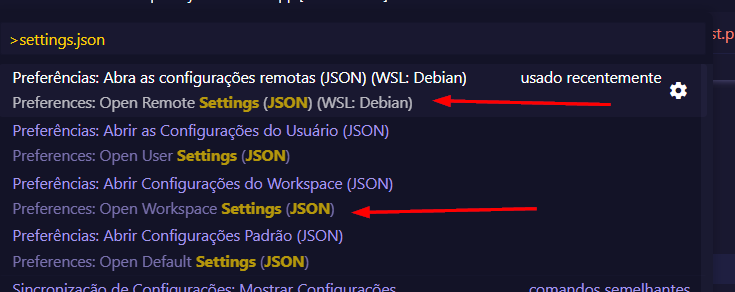

### WSL First steps.

```
apt-get update && apt-get install aptitude && aptitude install build-essential -y && aptitude install ssh wget ca-certificates git unzip curl

### PHP

aptitude install lsb-release apt-transport-https ca-certificates
sudo wget -O /etc/apt/trusted.gpg.d/php.gpg https://packages.sury.org/php/apt.gpg
echo "deb https://packages.sury.org/php/ $(lsb_release -sc) main" | sudo tee /etc/apt/sources.list.d/php.list
aptitude update -y
aptitude install -y php8.2
aptitude install -y php-intl php-mysql php-sqlite3 php-gd php-cli php-common php-zip php-curl php-xml php-bcmath php-xdebug php-soap php-pocv php-apcu php-redis php-memcached 

### COMPOSER 
cd ~
curl -sS https://getcomposer.org/installer -o /tmp/composer-setup.php
HASH=`curl -sS https://composer.github.io/installer.sig`
php -r "if (hash_file('SHA384', '/tmp/composer-setup.php') === '$HASH') { echo 'Installer verified'; } else { echo 'Installer corrupt'; unlink('composer-setup.php'); } echo PHP_EOL;"
php /tmp/composer-setup.php --install-dir=/usr/local/bin --filename=composer
```

### NODE
```
cd 
curl -fsSL https://deb.nodesource.com/setup_current.x | sudo -E bash -
aptitude update &&
aptitude install nodejs -y
```

### PHP CS ( NON ROOT )
```
composer global require squizlabs/php_codesniffer --dev

- After  , go to your composer installation folder
 - probably will be : /home/$USER/.config/composer/
 - Copy the content of composer.json to your composer.json and run *composer install*


### Create a shortcut to phpcs to run from anywhere in cli
sudo ln -s /home/$USER/.config/composer/vendor/squizlabs/php_codesniffer/bin/phpcs /usr/local/bin/phpcs
sudo ln -s /home/$USER/.config/composer/vendor/squizlabs/php_codesniffer/bin/phpcbf /usr/local/bin/phpcbf

phpcs --config-set php_path /usr/bin/php
phpcs --config-set default_standard PSR12
phpcs --config-set severity 1
phpcs --config-set colors 1
phpcs --config-set installed_paths /home/$USER/.config/composer/vendor/phpcompatibility/php-compatibility,/home/felix/.config/composer/vendor/dealerdirect/phpcodesniffer-composer-installer/src

phpcs --config-show   ### show configs
```

### CUSTOM PHPCS RULES
- create a file into a safe place, ex: /home/$USER/phpcs.xml
- Run into terminal
```
touch /home/$USER/phpcs.xml
```

```
Example of file 
<?xml version="1.0"?>
<ruleset name="Custom ruleset">
    <description>My rules for PHP CodeSniffer</description>
    <rule ref="PHPCompatibility"/>
    <rule ref="PSR2"/>
</ruleset>

- And change your phpcs rule

phpcs --config-set default_standard /home/$USER/phpcs.xml
```
- Copy the phpcs.xml to your local file.

- dont forget to update your VSCODE path 

### VS CODE Settings

- Type into your VSCODE CTRL + SHIFT + P and type:  settings.json
  - Click to open Remote settings ( WSL + YourWslDistroName )
  - Or 
  - Click to open : Workspace Settings

- Why ? Because some config not work if you put into your User Settings ( settings that are sync with your github/microsoft account )
- After open your settings , copy the settings.json content to your



------


### USING PHPCS
```
phpcs -p You/Folder  or Your/Folder/File.php

Example: 

phpcs /home/YourUser/projetos/projectTest/app/Enums/Example.php -p -v

### Output

Registering sniffs in the Custom ruleset standard... DONE (177 sniffs registered)
Creating file list... DONE (1 files in queue)
Changing into directory /home/YourUser/projetos/projectTest/app/Enums
Processing SourceType.php [PHP => 180 tokens in 34 lines]... DONE in 9ms (10 errors, 0 warnings)

FILE: /home/YourUser/projetos/projectTest/app/Enums/Example.php
---------------------------------------------------------------------------------------------
FOUND 10 ERRORS AFFECTING 6 LINES
---------------------------------------------------------------------------------------------
  7 | ERROR | [x] Expected 1 space before "int"; 0 found
  7 | ERROR | [x] Opening brace of a enum must be on the line after the definition
 16 | ERROR | [x] Expected 1 space(s) after MATCH keyword; 0 found
 16 | ERROR | [ ] "$this" can no longer be used in a plain function or method since PHP 7.1.
 19 | ERROR | [x] Blank line found at end of control structure
 26 | ERROR | [ ] "$this" can no longer be used in a plain function or method since PHP 7.1.
 26 | ERROR | [ ] Late static binding is not supported outside of class scope.
 31 | ERROR | [ ] "$this" can no longer be used in a plain function or method since PHP 7.1.
 31 | ERROR | [ ] Late static binding is not supported outside of class scope.
 34 | ERROR | [x] The closing brace for the enum must go on the next line after the body
---------------------------------------------------------------------------------------------
PHPCBF CAN FIX THE 5 MARKED SNIFF VIOLATIONS AUTOMATICALLY
---------------------------------------------------------------------------------------------
Time: 91ms; Memory: 10MB


And , to fix .

phpcbf /home/YourUser/projetos/projectTest/app/Enums/Example.php -p -v


### Output

PHPCBF RESULT SUMMARY
-----------------------------------------------------------------------------------------
FILE                                                                     FIXED  REMAINING
-----------------------------------------------------------------------------------------
/home/YourUser/projetos/projectTest/app/Enums/Example.php                  5      5
-----------------------------------------------------------------------------------------
A TOTAL OF 5 ERRORS WERE FIXED IN 1 FILE
-----------------------------------------------------------------------------------------

Time: 114ms; Memory: 10MB


### in this scenario , phpcbf fixed 5 errors but cant fix 5 , you need to fix manually.

```


### JS LINTERS ( ROOT )
```
npm i -g eslint
npm i -g prettier eslint-config-prettier eslint-plugin-prettier
npm install --global yarn
```

### GIT ( NON ROOT ) 
```
- For local config . If want to set this settings for all projects ,use : git config --global 
git config pull.rebase false 
git config user.name "Your Username"
git config user.email "Your git email "
```


### EXTENSIONS 
```
Nome: PHP Intelephense
ID: bmewburn.vscode-intelephense-client
Descrição: PHP code intelligence for Visual Studio Code
Editor: Ben Mewburn
Link do Marketplace do VS: https://marketplace.visualstudio.com/items?itemName=bmewburn.vscode-intelephense-client
```

```
Nome: phpcs
ID: shevaua.phpcs
Descrição: PHP CodeSniffer for Visual Studio Code
Editor: shevaua
Link do Marketplace do VS: https://marketplace.visualstudio.com/items?itemName=shevaua.phpcs
```

```
Nome: PHP Sniffer
ID: wongjn.php-sniffer
Descrição: Uses PHP_CodeSniffer to format and lint PHP code.
Editor: wongjn
Link do Marketplace do VS: https://marketplace.visualstudio.com/items?itemName=wongjn.php-sniffer
```

```
Nome: ESLint
ID: dbaeumer.vscode-eslint
Descrição: Integrates ESLint JavaScript into VS Code.
Editor: Microsoft
Link do Marketplace do VS: https://marketplace.visualstudio.com/items?itemName=dbaeumer.vscode-eslint
```

```
Nome: Prettier - Code formatter
ID: esbenp.prettier-vscode
Descrição: Code formatter using prettier
Editor: Prettier
Link do Marketplace do VS: https://marketplace.visualstudio.com/items?itemName=esbenp.prettier-vscode
```
